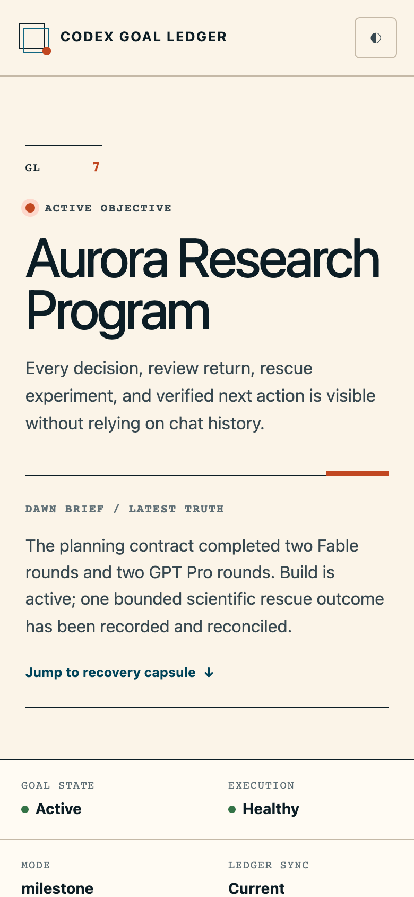
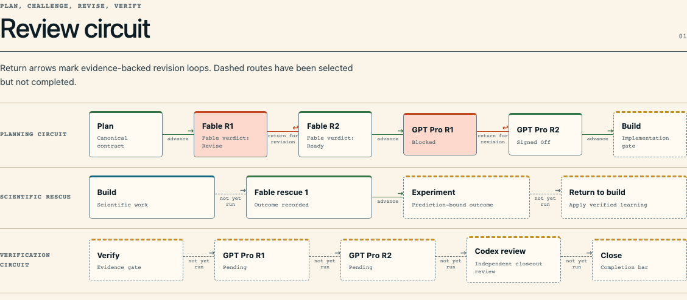
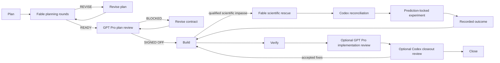

# Codex Goal Ledger

Codex Goal Ledger turns a long-running task into a durable, repository-local run record. The canonical plan and progress stay in Markdown; the generated dashboard makes execution state, evidence, review loops, recovery, and remaining gates easy to inspect.

It is designed for work that can outlive one chat session: difficult implementations, research programs, scientific investigations, and high-context reviews where “done” needs evidence.

<p align="center">
  
</p>

<p align="center"><sub>Real Goal Ledger rendering from a neutral synthetic fixture. No user, client, or project data is included.</sub></p>

<details>
  <summary>Responsive mobile view</summary>
  <p align="center">
    
  </p>
</details>

## What it adds

- Durable `goal.md` and `progress.md` files with generated HTML, never HTML as the source of truth.
- Separate progress tracks for run phases, evidence, selected reviews, and open gates—without a synthetic overall percentage.
- Optional multi-round Claude Fable planning review with critique, feature proposals, science proposals, and explicit reconciliation.
- Native GPT Pro review packets: a GPT-5.6-oriented review prompt, scoped context ZIP, checksummed manifest, complete raw response, and typed local reconciliation.
- Platform-aware GPT Pro delivery routing: Safari, Chrome, the ChatGPT desktop app, then a checksum-bound manual handoff.
- Bounded Claude Fable scientific rescue when a hard scientific question stalls implementation.
- Owned Codex implementation and review agents, including Luna, Sol, and Terra effort presets and mixed swarms.
- HTTP preview over Tailscale when available, with a localhost fallback; no `file://` dependency.
- Recovery capsules and clean-session handoffs that state the last verified truth and exact next action.

## Review and rescue circuit

The dashboard derives this circuit from preserved evidence. A blocked or revise verdict creates a visible return path; a selected but unfinished review stays dashed.

<p align="center">
  
</p>

The three review roles are intentionally different:

- **Fable planning peer** challenges the plan before Build. It may propose missing information, features, and scientific hypotheses. Selecting it authorizes preparing the Anthropic review lane; each exact read-only manifest still receives an owner-facing native approval checkbox, then is preserved and reconciled before the next round.
- **GPT Pro** is an independent high-context gate for the plan, the implementation, or both. A `BLOCKED` result returns to revision; `SIGNED OFF` advances only after Codex records a typed, locally verified reconciliation.
- **Codex closeout reviewer** runs after Verify. Accepted findings return to Build or Verify, then the closeout evidence is refreshed before Close.

**Fable rescue is not another routine review.** It is available only after Build reaches a qualified scientific impasse and operational causes have been ruled out. The rescue packet freezes the question, evidence, competing explanations, prediction, and experiment boundary. Fable remains advisory; Codex must classify every proposal, run the authorized prediction-locked experiment, record the outcome, and return the verified learning to Build. Rescue advice can never serve as completion evidence by itself.



The incident budget, approved repository scope, exact transmitted manifest, and experiment authority are fixed in the goal contract. A new scientific question or expanded file scope requires a new authorized incident rather than silently extending the old one.

## Install

From this repository:

```bash
python3 scripts/install_skill.py --with-agents
python3 scripts/install_skill.py --replace --configure-review-approvals
python3 scripts/install_skill.py --check --with-agents
python3 scripts/install_skill.py --check --configure-review-approvals
```

The installer copies the skill and its owned agents into the Codex skill directory. It also checks the multi-agent settings the workflow depends on:

```toml
[features.multi_agent_v2]
hide_spawn_agent_metadata = false
max_concurrent_threads_per_session = 8
tool_namespace = "agents"
```

If configuration is missing or incompatible, the skill reports the exact fix rather than silently claiming that an agent profile was used.

Fable also needs an owner-facing native approval route for each exact manifest. The explicit `--configure-review-approvals` option preserves a backup of `config.toml` and sets only:

```toml
approvals_reviewer = "user"
approval_policy = "on-request"
```

Open a new Codex task after changing these values. A Fable `yes` is lane authorization to prepare review packets; the later native checkbox is the separate approval to transmit one disclosed digest. The skill never manufactures exact approval from an agent-authored allow-list or asks for a typed consent sentence.

## Use

Invoke `$codex-goal-ledger` and describe the outcome. The skill asks planning choices up front—using native chat controls when available—so review work does not sit idle until the end of planning.

For direct initialization, this is the minimal shape:

```bash
python3 scripts/init_goal.py \
  --project-root /path/to/project \
  --slug example-goal \
  --title "Example Goal" \
  --why "The work needs a durable execution contract." \
  --outcome "The result is verified and recoverable." \
  --fable-feedback yes \
  --fable-rescue yes \
  --pro-review yes \
  --codex-review yes
```

Then render and serve the dashboard over HTTP:

```bash
python3 scripts/render_goal.py docs/goals/example-goal --sync-assets
python3 scripts/serve_dashboard.py docs/goals/example-goal --host-mode auto
```

## Custody model

External reviewers receive only the files listed in the packet manifest. Every packet is hashed, every response is preserved in full, and every recommendation gets an explicit local disposition. Requested, invoked, and effective model identities are recorded separately; an unconfirmed runtime identity stays unconfirmed.

The dashboard is a view over those artifacts. It does not infer success from prose, elapsed time, a reviewer’s confidence, or an agent’s claim.

## Validate

```bash
python3 scripts/test_goal_ledger.py
python3 scripts/test_execution_profile.py
python3 scripts/test_fable_feedback.py
python3 scripts/test_fable_transport.py
python3 scripts/test_fable_rescue.py
python3 scripts/test_pro_review.py
python3 scripts/test_review_graph.py
python3 scripts/test_preview_server.py
python3 scripts/test_closeout_prompts.py
python3 scripts/test_install_skill.py
```

The README screenshots are generated from a synthetic goal named **Aurora Research Program**. They contain no real goal, repository, user, or client information.
