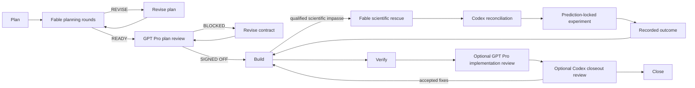

# Codex Goal Ledger

Codex Goal Ledger turns a long-running task into a durable, repository-local run record. The canonical plan and progress stay in Markdown; the generated dashboard makes execution state, evidence, review loops, recovery, and remaining gates easy to inspect.

It is designed for work that can outlive one chat session: difficult implementations, research programs, scientific investigations, and high-context reviews where “done” needs evidence.

<p align="center">
  
</p>

<p align="center"><sub>Real Goal Ledger rendering from a neutral synthetic fixture. No user, client, or project data is included.</sub></p>

<details>
  <summary>Responsive mobile view</summary>
  <p align="center">
    
  </p>
</details>

## What it adds

- Durable `goal.md` and `progress.md` files with generated HTML, never HTML as the source of truth.
- Separate progress tracks for run phases, evidence, selected reviews, and open gates—without a synthetic overall percentage.
- Optional multi-round Claude Fable planning review with critique, feature proposals, science proposals, and explicit reconciliation.
- Native GPT Pro review packets: a GPT-5.6-oriented review prompt, scoped context ZIP, checksummed manifest, complete raw response, and typed local reconciliation.
- A bundled restricted MCP App that gives ChatGPT real planning checkboxes and lets GPT Pro review only the immutable packet—without DevSpace, a separate plugin, live repository access, or shell tools.
- Platform-aware GPT Pro delivery routing: the bundled restricted MCP App when already connected and ready, then Safari/Chrome and a checksum-bound manual handoff. The ChatGPT desktop/classic app is excluded because Computer Use cannot safely control its own host app.
- Bounded Claude Fable scientific rescue when a hard scientific question stalls implementation.
- Owned Codex implementation and review agents, including Luna, Sol, and Terra effort presets and mixed swarms.
- HTTP preview over Tailscale when available, with a localhost fallback; no `file://` dependency.
- Recovery capsules and clean-session handoffs that state the last verified truth and exact next action.
- One goal, one execution envelope: once planning is resolved, in-scope web and literature research, hardware investigation, dependency setup, implementation, local compute, qualification, testing, reviews, recovery, and frozen retries continue unattended without repeated consent prompts.
- Durable unattended execution: tmux availability is preflighted, the outer supervisor runs detached from the Codex terminal, and validated checkpoints let recovery reuse completed work instead of restarting an entire campaign.

## Review and rescue circuit

The dashboard derives this circuit from preserved evidence. A blocked or revise verdict creates a visible return path; a selected but unfinished review stays dashed.

<p align="center">
  
</p>

The three review roles are intentionally different:

- **Fable planning peer** challenges the plan before Build. It may propose missing information, features, and scientific hypotheses. Selecting it authorizes preparing the Anthropic review lane; each exact read-only manifest still receives an owner-facing native approval checkbox, then is preserved and reconciled before the next round.
- **GPT Pro** is an independent high-context gate for the plan, the implementation, or both. A `BLOCKED` result returns to revision; `SIGNED OFF` advances only after Codex records a typed, locally verified reconciliation.
- **Fast gate reviewer** uses Luna High for repeated manifest, custody, dashboard, launch, recovery, and narrow post-fix checks. It returns `GO`, `BLOCKED`, or `NEEDS_DEEP_REVIEW` without occupying the Sol Ultra planning lane.
- **Codex closeout reviewer** uses Sol XHigh after Verify. Accepted findings return to Build or Verify, then the closeout evidence is refreshed before Close.

**Fable rescue is not another routine review.** It is available only after Build reaches a qualified scientific impasse and operational causes have been ruled out. The rescue packet freezes the question, evidence, competing explanations, prediction, and experiment boundary. Fable remains advisory; Codex must classify every proposal, run the authorized prediction-locked experiment, record the outcome, and return the verified learning to Build. Rescue advice can never serve as completion evidence by itself.



The incident budget, approved repository scope, exact transmitted manifest, and experiment authority are fixed in the goal contract. A new scientific question or expanded file scope requires a new authorized incident rather than silently extending the old one.

## Install

From this repository:

```bash
python3 scripts/install_skill.py --with-agents --with-review-bridge
python3 scripts/install_skill.py --replace --configure-review-approvals
python3 scripts/install_skill.py --check --with-agents --with-review-bridge
python3 scripts/install_skill.py --check --configure-review-approvals
```

The installer copies the skill and its owned agents into the Codex skill directory. It also checks the multi-agent settings the workflow depends on:

Replaced skill versions are archived under `$CODEX_HOME/backups/skills/`, never beside the active skill where Codex could discover them as duplicate skills. A normal install also migrates legacy sibling `codex-goal-ledger.backup-*` directories into that archive; `--check` reports legacy backups without changing them.

```toml
[features.multi_agent_v2]
hide_spawn_agent_metadata = false
max_concurrent_threads_per_session = 8
tool_namespace = "agents"

[agents]
max_threads = 8
max_depth = 1
```

If configuration is missing or incompatible, the skill reports the exact fix rather than silently claiming that an agent profile was used.

`--with-review-bridge` makes the private GPT Pro bridge an installer-owned, resumable setup. Existing Keychain credentials, tunnel profiles, managed runtimes, and the verified ChatGPT app are reused automatically. On first install, Codex continues in Safari, then Chrome if needed, and asks only at the required account-security boundaries: creating the Tunnels-only runtime key and enabling/connecting ChatGPT Developer mode. The key is restricted to Tunnels Read + Use, stored in macOS Keychain, removed from the clipboard, and never written to the skill, profile, ledger, or Git. No API credits or model permissions are enabled; GPT Pro usage remains on the ChatGPT subscription.

Fable also needs an owner-facing native approval route for each exact manifest. The explicit `--configure-review-approvals` option preserves a backup of `config.toml` and sets only:

```toml
approvals_reviewer = "user"
approval_policy = "on-request"
```

Open a new Codex task after changing these values. A Fable `yes` is lane authorization to prepare review packets; the later native checkbox is the separate approval to transmit one disclosed digest. The skill never manufactures exact approval from an agent-authored allow-list or asks for a typed consent sentence.

### Optional direct GPT Pro bridge

Goal Ledger ships `scripts/run_review_bridge.py` and its MCP App widget inside the skill. The bridge is bound to one prepared review round, reads only manifest-listed members from `context-packet.zip`, and can write only the immutable Pro response and custody metadata. It has no generic file, Git, shell, or live-repository tools.

Use OpenAI Secure MCP Tunnel so the local server remains private. After the one-time ChatGPT developer-app connection, preflight and print the exact round-bound command:

```bash
python3 scripts/run_review_bridge.py check \
  --goal-dir docs/goals/example-goal --stage plan --round 1 \
  --require-tunnel-client
python3 scripts/run_review_bridge.py print-command \
  --goal-dir docs/goals/example-goal --stage plan --round 1
```

Use the printed stdio command in the tunnel profile, then open the `Codex Goal Ledger` app in a visible GPT Pro conversation. The widget records submission custody, writes a packet-hash-bound receipt for every member Pro reads, and accepts a response only after every member was read and all four required sections are non-empty. The [detailed one-time setup and review bridge runbook](references/review-bridge.md#detailed-one-time-setup) covers installation, Platform permissions, tunnel and runtime-key creation, ChatGPT developer mode, private app registration, verification, per-review rebinding, credential handling, and recovery.

The [automatic Codex-driven setup](references/review-bridge.md#automatic-codex-driven-setup) documents the exact Safari/Chrome, Keychain, managed-runtime, subscription-only, connection-verification, and idempotent recovery sequence used by the installer.

<p align="center">
  
</p>

<p align="center"><sub>Planning mode replaces the typed yes/no questionnaire with real checkboxes and bounded selectors.</sub></p>

<details>
  <summary>Immutable GPT Pro packet console</summary>
  <p align="center">
    
  </p>
</details>

## Use

Invoke `$codex-goal-ledger` in Plan mode and describe the outcome. The skill asks planning choices up front through native click controls, then uses a stepped model-family/effort selector for the primary implementer. The current Codex control does not expose a literal multi-select checkbox group or range slider. When it is unavailable, the bundled MCP App can render six real checkboxes and bounded selectors inside ChatGPT; if that app is not connected, the skill uses one concise checklist rather than pretending native controls were shown.

For direct initialization, this is the minimal shape:

```bash
python3 scripts/init_goal.py \
  --project-root /path/to/project \
  --slug example-goal \
  --title "Example Goal" \
  --why "The work needs a durable execution contract." \
  --outcome "The result is verified and recoverable." \
  --fable-feedback yes \
  --fable-rescue yes \
  --pro-review yes \
  --codex-review yes
```

Then render and serve the dashboard over HTTP:

```bash
python3 scripts/render_goal.py docs/goals/example-goal --sync-assets
python3 scripts/serve_dashboard.py docs/goals/example-goal --host-mode auto
```

## Custody model

Goal Ledger treats the phase rail as the primary milestone, not a mutex. Independent workstreams may run concurrently when their real prerequisites are satisfied. Planning records each lane's deliverable, blockers, mutation class, state, owner, evidence path, and bounded slot allocation; research is kept separate from implementation, purchases, and live hardware actions so a scientific gate does not unnecessarily idle hardware or software research. Root orchestration reserves capacity for supervision and review, and workers cannot recursively create an unplanned second swarm.

External reviewers receive only the files listed in the packet manifest. Every packet is hashed, every response is preserved in full, and every recommendation gets an explicit local disposition. Requested, invoked, and effective model identities are recorded separately; an unconfirmed runtime identity stays unconfirmed.

The dashboard is a view over those artifacts. It does not infer success from prose, elapsed time, a reviewer’s confidence, or an agent’s claim.

## Validate

```bash
python3 scripts/test_goal_ledger.py
python3 scripts/test_execution_profile.py
python3 scripts/test_fable_feedback.py
python3 scripts/test_fable_transport.py
python3 scripts/test_fable_rescue.py
python3 scripts/test_pro_review.py
python3 scripts/test_review_bridge.py
python3 scripts/test_setup_review_bridge.py
python3 scripts/test_review_graph.py
python3 scripts/test_preview_server.py
python3 scripts/test_closeout_prompts.py
python3 scripts/test_install_skill.py
```

Before a long-running or overnight command, verify the durable execution dependency:

```bash
python3 scripts/execution_profile.py preflight --require-tmux
```

Goal Ledger records the tmux binary and version, launches the outermost monitor or supervisor in a detached task-scoped session, and verifies its first heartbeat. Tmux prevents terminal/task boundaries from killing the monitor; atomic result checkpoints remain required for true computational resume.

The README screenshots are generated from a synthetic goal named **Aurora Research Program** and neutral MCP fixtures. They contain no real goal, repository, user, or client information.
